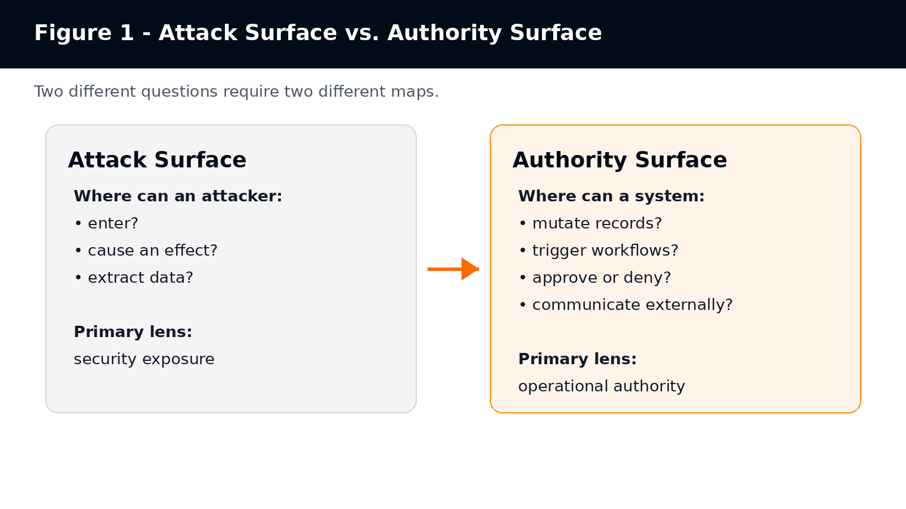
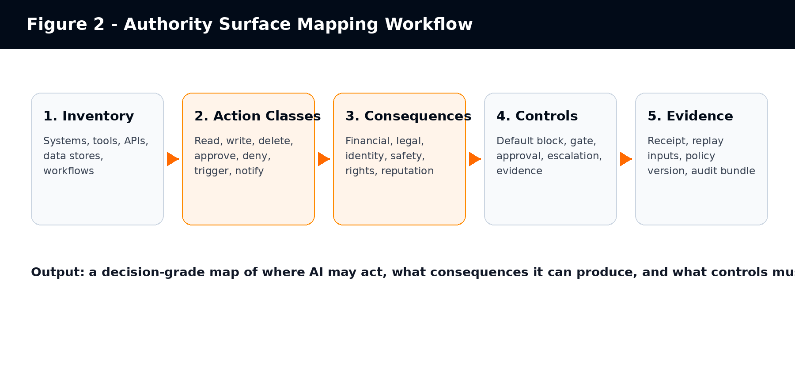
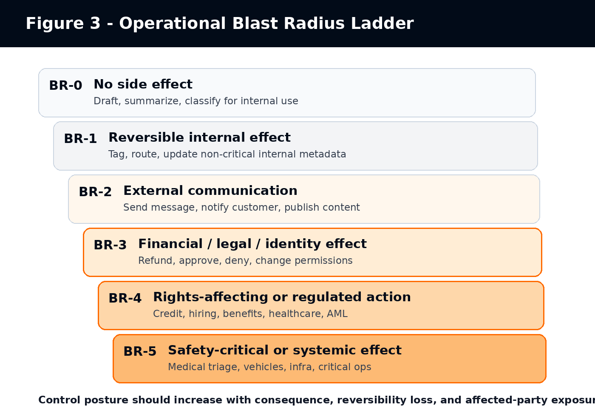
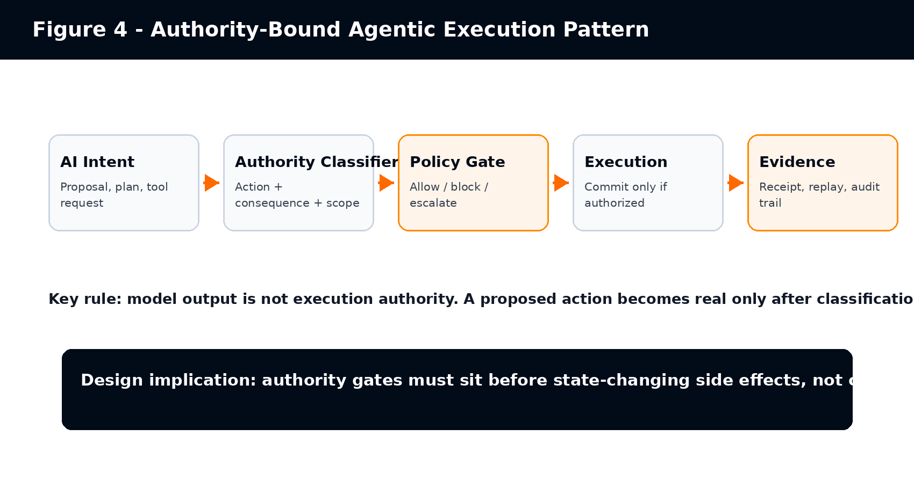

# Authority Surface Mapping

## Operational Authority Boundaries for Agentic AI Systems

**Version:** v1.0  
**Publication date:** 2026-05-20  
**Publisher:** Agentius / Zaubern  
**Status:** Public category-definition draft  
**Canonical URL:** https://agentius.ai/research/authority-surface-mapping

## Citation Format

> Cite as: Agentius / Zaubern. (2026). *Authority Surface Mapping: Operational Authority Boundaries for Agentic AI Systems* (v1.0). Retrieved from https://agentius.ai/research/authority-surface-mapping

## Abstract

This paper proposes Authority Surface as a practical category model for agentic AI governance. The term is introduced as a proposed technical concept, not as an established standard. Authority Surface refers to the operational boundary across which an AI system, autonomous agent, software process, or semi-autonomous workflow can produce state-changing effects inside an environment. The paper distinguishes Authority Surface from the established cybersecurity concept of attack surface, relates it to access control, AI risk management, OWASP agentic AI risks, MCP-style tool invocation, and EU AI Act requirements for human oversight and logging. It also defines a taxonomy, a blast-radius model, and a mapping method that organizations can use before expanding AI from advisory use into operational authority.

## Publisher Note: Term Status and Review Boundary

Authority Surface is presented here as a proposed term and category model introduced by Agentius / Zaubern. It should not be represented as an established term in NIST, OWASP, EU AI Act, ISO, or academic literature unless and until independent third-party sources adopt and discuss it directly. Existing sources cited in this paper support related concepts: attack surface, authorization, AI risk management, excessive agency, tool invocation, human oversight, and logging. They do not independently validate the term Authority Surface itself.

This distinction matters. The paper is designed as a category-definition artifact and technical reference. It is not a Wikipedia article, not a standards claim, and not a legal compliance certification.

## Executive Summary

Enterprise AI is moving from copilots to operational actors. Once an AI system can call tools, update records, route decisions, trigger workflows, contact customers, approve exceptions, or affect money, the central governance question changes. The question is no longer only whether the model is accurate, safe, or secure. The question becomes: what operational authority can this system exercise, and under what constraints?

Cybersecurity already has a mature concept for exposure to adversarial entry and manipulation: attack surface. NIST defines attack surface as points on a system boundary where an attacker can enter, cause an effect, or extract data [S1]. That framing remains necessary. It is not sufficient for agentic AI. A system can be protected from intrusion and still expose too much operational authority to a model-mediated actor.

Authority Surface fills that analytical gap. It asks where an AI-connected system can produce consequence-bearing state change: read, write, delete, approve, deny, route, notify, pay, escalate, deploy, or otherwise mutate reality.

- Attack surface asks where a system can be attacked.
- Authority surface asks where a system can act.
- Access control asks whether a subject may access a resource.
- Authority surface asks what consequences become possible once access exists.
- AI risk management asks how organizations map, measure, govern, and manage AI risks.
- Authority Surface Mapping specializes that work around operational authority and side effects.

The paper defines a taxonomy for action type, consequence class, reversibility, affected-party exposure, governance mode, evidence requirement, and propagation path. It also proposes an Operational Blast Radius ladder to classify AI actions from low-consequence advisory output to safety-critical or systemic action. The purpose is not to create another compliance checklist. The purpose is to make authority legible before AI systems reach execution.

---

## 1. Why a New Surface Model Is Needed

Traditional enterprise AI governance often focuses on model selection, model evaluation, prompt controls, data handling, policy documentation, human review, and audit trails. Those practices remain valuable. They do not necessarily locate the point where model output becomes operational state change.

Consider an e-commerce support agent connected to order history, refund tooling, email, and a ticketing system. If it only drafts a response, the authority surface is narrow. If it can issue refunds, change account status, and send binding customer communications, the same model-mediated workflow now carries financial, legal, and reputational authority.

Agentic systems create a structural shift. The Model Context Protocol specification states that servers can expose tools invoked by language models and that tools enable models to interact with external systems such as databases, APIs, or computational services [S5]. It also describes MCP tools as model-controlled, meaning the model can discover and invoke tools automatically based on context and prompts [S5]. This converts language output into potential operational action.

OWASP treats this as a real security and governance problem. Its LLM06:2025 Excessive Agency risk describes LLM-based systems being granted agency through functions, tools, skills, or plugins, and identifies excessive functionality, excessive permissions, and excessive autonomy as root causes of damaging actions [S6]. OWASP also states that once AI began taking actions, the nature of security changed forever [S7].

Authority Surface is proposed as a way to map this shift. It is not a replacement for cybersecurity, access control, AI risk management, or regulatory governance. It is a complementary model focused on operational authority: what the AI-connected system can actually cause to happen.

## 2. Definitions

### 2.1 Authority Surface

Authority Surface is the operational boundary across which an AI system, autonomous agent, software process, or semi-autonomous workflow can produce state-changing effects inside an environment.

An authority surface includes the systems, records, workflows, tools, permissions, messages, decisions, escalations, financial actions, identity actions, legal commitments, and physical operations that a system can affect.

> **Working question: Where can AI actually exercise authority?**

### 2.2 Authority Surface Mapping

Authority Surface Mapping is the process of identifying, modeling, constraining, and governing the operational authority that can be exercised by AI systems, autonomous agents, tools, workflows, or software actors.

A useful authority surface map identifies reachable systems, callable tools, action classes, consequence classes, escalation paths, human approval requirements, evidence requirements, policy gates, operational blast radius, and default-blocked actions.

### 2.3 Authority Propagation

Authority propagation occurs when a system’s ability to act expands through delegation, tool access, workflow chaining, memory, agent-to-agent coordination, automation triggers, or integration with systems of record.

### 2.4 Operational Blast Radius

Operational Blast Radius is the consequence footprint of an incorrect, unauthorized, late, overconfident, or contextually invalid AI action.

### 2.5 Authority Gate

An authority gate is a pre-execution control that classifies a proposed action, evaluates it against policy and context, and returns allow, block, or escalate before state change occurs.

## 3. Difference From Existing Concepts

**Table 1 - Authority Surface contrasted with related governance and security concepts**

| Concept | Primary Question | Authority Surface Contrast |
| --- | --- | --- |
| Attack surface | Where can an attacker enter, cause an effect, or extract data? | Where can the system itself exercise operational authority? |
| Authorization / access control | Is this subject allowed to access this resource? | What operational consequences become possible after access exists? |
| Observability | What happened, and can operators inspect it? | Could the action have been constrained before it committed? |
| Human approval | Did a human approve something? | Was the approval structurally tied to the action class, context, evidence, and consequence? |
| AI risk management | How are AI risks governed, mapped, measured, and managed? | Which concrete side effects can an AI-connected system produce, and what controls bind them? |

NIST defines authorization partly as rights or permissions granted to a system entity to access a system resource, and also as the process of granting or denying specific requests to obtain and use information processing services [S2]. Authority Surface is broader than access. An agent may have legitimate read access to a customer database and still lack legitimate authority to alter customer status, approve compensation, or send binding communications.

NIST AI RMF provides a useful parent frame because it organizes AI risk work around Govern, Map, Measure, and Manage. The AI RMF Core describes these functions as outcomes and actions that enable dialogue, understanding, and activities to manage AI risks [S4]. Authority Surface Mapping can be treated as a specialized mapping activity inside that broader risk-management lifecycle.

## 4. The Authority Surface Taxonomy

Authority Surface Mapping requires more precision than a binary “tool access/no tool access” label. A useful taxonomy must separate what a system can do, where it can do it, what consequences follow, whether the action is reversible, whether humans are affected, and what evidence must exist.

**Table 2 - Authority Surface taxonomy dimensions**

| Dimension | Values / Questions | Why It Matters |
| --- | --- | --- |
| Action type | read, write, delete, approve, deny, trigger, route, notify, pay, deploy | Different action verbs create different risk and control requirements. |
| Target surface | database, API, ticketing system, email, payment rail, HRIS, EHR, repository, CI/CD, identity provider | Authority is attached to concrete operational systems. |
| Consequence class | informational, financial, legal, identity, safety, reputational, rights-affecting | Consequence determines governance depth. |
| Reversibility | reversible, compensable, partially reversible, irreversible | Irreversibility raises escalation and evidence requirements. |
| Affected-party exposure | none, internal team, customer, employee, patient, applicant, citizen, market participant | Human impact changes oversight and regulatory posture. |
| Autonomy level | draft only, recommend, auto-route, execute with alert, execute with gate, execute only after approval | Autonomy must be mapped per action, not per system. |
| Governance mode | logged, monitored, alerted, gated, human-approved, blocked by default | Control must match consequence. |
| Evidence requirement | none, system log, signed receipt, replay bundle, regulator-facing audit package | Evidence must be designed before disputes arise. |
| Propagation path | single tool, chained workflow, multi-agent, memory-driven, human-mediated, delegated | Authority can expand through connections even when each connection looks narrow. |

## 5. Operational Blast Radius

Blast radius is a practical way to prevent governance collapse into generic risk scoring. The same model can produce low-risk and high-risk outputs depending on where its output goes. A summary drafted inside a notebook and a payment instruction submitted to a financial system belong to different blast-radius classes even if the same model produced both.

**Table 3 - Operational Blast Radius ladder**

| Level | Description | Examples | Default Governance Posture |
| --- | --- | --- | --- |
| BR-0 | No side effect | Summarization, classification for internal review, brainstorming | No execution gate required; ordinary usage policy may suffice. |
| BR-1 | Reversible internal effect | Tagging a ticket, updating non-critical internal metadata | Logging and reviewable workflow history. |
| BR-2 | External communication or workflow routing | Customer email, support escalation, notification, task creation | Human review or policy gate depending on audience and content. |
| BR-3 | Financial, legal, identity, or operational effect | Refund, account status change, permission update, contract workflow trigger | Pre-execution gate, approval or escalation, evidence receipt. |
| BR-4 | Rights-affecting or regulated decision | Credit, hiring, benefits, AML, healthcare eligibility, insurance claims | Strict gating, human oversight, audit evidence, defined responsibility boundary. |
| BR-5 | Safety-critical or systemic effect | Medical triage, autonomous vehicles, industrial control, critical infrastructure | Default block unless high-assurance controls, independent verification, and emergency procedures exist. |

## 6. Authority Propagation Patterns

Authority rarely expands through a single dramatic event. It expands through everyday integration decisions: a new tool, a wider OAuth scope, a generic service account, a background agent, a shared memory store, or a workflow trigger added for convenience.

- Tool propagation: the model gains callable tools that reach downstream systems.
- Permission propagation: a tool uses credentials broader than the user or task requires.
- Workflow propagation: one tool call triggers downstream processes not visible to the agent designer.
- Memory propagation: stored context changes future decisions or future tool use.
- Agent-to-agent propagation: one agent writes inputs, instructions, or artifacts later used by another agent.
- Human-mediated propagation: AI-generated recommendations influence a human approver who is overloaded, over-trusting, or missing context.
- Policy propagation: policy updates, feature flags, or deployment changes alter what the agent can do without re-mapping authority.

MCP-style architectures make this especially important because the protocol is explicitly designed to expose tools that models can invoke and because security considerations include validating tool inputs, implementing access controls, rate limiting, sanitizing outputs, prompting for user confirmation on sensitive operations, and logging tool usage [S5].

OWASP’s Excessive Agency guidance similarly recommends minimizing extensions, minimizing extension permissions, requiring user approval for high-impact actions, and implementing authorization in downstream systems rather than relying on an LLM to decide whether an action is allowed [S6]. Authority Surface Mapping gives organizations a language for organizing those mitigations around consequence-bearing actions.

## 7. Relationship to NIST, OWASP, MCP, and EU AI Act

### 7.1 NIST Attack Surface

Authority Surface deliberately borrows the “surface” metaphor from cybersecurity, but changes the object of analysis. NIST’s attack surface definition focuses on attacker entry, effects, or data extraction at system boundaries [S1]. Authority Surface focuses on the system’s own permitted or de facto ability to act.

### 7.2 NIST Authorization and Access Control

NIST authorization terminology is relevant because AI agents often act through identities, permissions, OAuth scopes, service accounts, or delegated credentials. However, access control is only one layer. A user or agent can be authorized to access a system while still lacking legitimate authority to perform a specific business action in a specific context [S2].

### 7.3 NIST AI Risk Management Framework

NIST AI RMF is a parent risk-management structure. NIST describes the AI RMF as intended to improve the ability to incorporate trustworthiness considerations into the design, development, use, and evaluation of AI systems [S3]. The AI RMF Core is organized around Govern, Map, Measure, and Manage functions [S4]. Authority Surface Mapping fits primarily inside Map and Manage, while informing Govern and Measure.

### 7.4 OWASP Agentic AI and Excessive Agency

OWASP’s agentic security work gives strong external support for the underlying problem. OWASP describes agents bending legitimate tools into destructive outputs, identity and privilege abuse, agentic supply chain vulnerabilities, memory poisoning, insecure inter-agent communication, cascading failures, and human-agent trust exploitation [S7]. Its Excessive Agency page links damaging actions to excessive functionality, permissions, and autonomy [S6]. Authority Surface Mapping translates those risks into an operational mapping method.

### 7.5 Model Context Protocol

MCP is important because it operationalizes model-tool interaction. The MCP tools specification states that servers expose tools invoked by language models and that those tools can query databases, call APIs, or perform computations [S5]. It also recommends user confirmation for sensitive operations and tool usage logging [S5]. Authority Surface Mapping asks which of those tool invocations can produce consequential state changes and what control must exist before the call commits.

### 7.6 EU AI Act

The EU AI Act is relevant because high-risk AI systems require human oversight and logging. Article 14 states that high-risk AI systems shall be designed and developed so they can be effectively overseen by natural persons during use, and that oversight should help prevent or minimize risks to health, safety, or fundamental rights [S8]. Article 12 requires high-risk AI systems to technically allow automatic recording of events over the system lifecycle and to support traceability appropriate to the intended purpose [S9].

Authority Surface Mapping does not itself create legal compliance. It can help organizations identify where oversight, logging, escalation, and evidence must attach to state-changing AI actions. The official legal source remains Regulation (EU) 2024/1689 [S10].

## 8. Industry Examples

**Table 4 - Example Authority Surfaces by industry**

| Industry / Function | Low Authority Surface | High Authority Surface | Mapping Focus |
| --- | --- | --- | --- |
| Customer support | FAQ answer, summary draft | refund, account closure, customer notice, legal escalation | communication authority, refund thresholds, complaint routing |
| Finance operations | invoice summary, variance explanation | payment approval, vendor master change, fraud flag, AML escalation | money movement, segregation of duties, evidence receipts |
| Banking / credit | document extraction, eligibility explanation | credit approval, limit assignment, KYC tier, SAR-relevant alert | rights-affecting decision class, human escalation, audit replay |
| Healthcare administration | appointment summary, coding suggestion | triage priority, coverage eligibility, referral routing, patient notice | patient impact, clinical oversight boundary, reversibility |
| Human resources | job description draft, interview question suggestion | candidate ranking, rejection routing, compensation recommendation, employee record update | employment rights, protected characteristics, review process |
| Procurement | supplier summary, RFP drafting | vendor approval, purchase order release, exception approval, contract workflow trigger | financial commitment, supplier risk, approval authority |
| Legal operations | case summary, clause comparison | legal notice, settlement workflow, regulatory filing, privilege classification | legal consequence, privilege, attorney review |
| Software engineering | code suggestion, test generation | repository write, secret access, deployment, infrastructure mutation | CI/CD gates, secrets, rollback, production change authority |
| Public sector | policy summary, intake triage | benefit eligibility, enforcement prioritization, citizen notification | rights impact, transparency, appealability |

## 9. Common Anti-Patterns

- Secure perimeter fallacy: assuming that because an agent runs inside a trusted environment, its actions are legitimate.
- Observability fallacy: assuming logs and dashboards govern execution when they only describe it after the fact.
- Generic human-in-the-loop theater: placing a human somewhere in the workflow without tying review to consequence class, evidence, and authority.
- Tool-name blindness: treating a tool as safe because it has a benign name while ignoring downstream permissions and side effects.
- Service-account overreach: using a privileged shared identity for agent actions that should inherit user or task scope.
- Prompt-as-policy: relying on natural-language instructions to prevent high-impact tool misuse.
- Model-evaluation substitution: assuming pre-release model testing authorizes post-release side effects.
- Approval-after-commit: reviewing actions after they already changed operational state.
- Silent authority drift: expanding tools, permissions, memory, or workflow triggers without re-mapping authority surface.

## 10. Reference Architecture

A vendor-neutral architecture for authority-bound agentic execution can be described without relying on any specific vendor runtime or product. The minimum pattern is a five-stage control chain: capture the proposed AI action, classify the authority it would exercise, adjudicate it against policy, execute only after a valid decision, and record evidence as part of the action lifecycle. The important design rule is placement: authority controls must sit before state-changing side effects, while logs and dashboards remain secondary evidence surfaces.

**Table 5 - Authority-bound execution stages**

| Stage | Question | Required Output |
| --- | --- | --- |
| Intent capture | What is the AI proposing to do? | Proposed action, target system, requested tool, context. |
| Authority classification | What kind of authority would this exercise? | Action type, consequence class, reversibility, affected-party exposure. |
| Policy adjudication | Is the action allowed under current policy and context? | Allow, block, escalate, or require human approval. |
| Execution | Can the side effect commit now? | Committed action or blocked/escalated action. |
| Evidence | Can a third party understand why this happened? | Receipt, policy version, inputs, decision trace, operator identity where relevant. |

## 11. Authority Surface Maturity Model

**Table 6 - Authority Surface Mapping maturity model**

| Level | Name | Description | Typical Failure Mode |
| --- | --- | --- | --- |
| ASM-0 | Unmapped authority | Teams know which models are used but not which side effects they can cause. | AI pilots expand into production through informal tool access. |
| ASM-1 | Tool inventory | Tools and integrations are known, but consequences are not classified. | Read/write/delete/approve actions are treated as equivalent tool calls. |
| ASM-2 | Action classification | Actions are classified by type and target system. | Controls remain generic and not tied to blast radius. |
| ASM-3 | Blast-radius mapping | Consequences, reversibility, and affected-party exposure are mapped. | Escalation and evidence remain inconsistent. |
| ASM-4 | Pre-execution controls | High-consequence actions are gated, approved, or blocked before commit. | Evidence may still be fragmented or non-replayable. |
| ASM-5 | Evidence-bound authority | Action decisions are replayable, policy-bound, and auditable across workflows. | Ongoing drift requires periodic remapping and change control. |

## 12. Minimal Worksheet

The following worksheet can be used for any proposed AI workflow before tool access is granted or expanded.

**Table 7 - Authority Surface Mapping worksheet**

| Question | Answer / Evidence Required |
| --- | --- |
| What business workflow is being automated? | Workflow owner, goal, target system, operating context. |
| Which systems can the AI reach? | APIs, databases, applications, files, identity systems, communication channels. |
| Which actions can it perform? | Read, write, delete, approve, deny, trigger, route, notify, pay, deploy. |
| Which actions mutate state? | List all state-changing actions separately. |
| Which people or rights can be affected? | Customers, employees, applicants, patients, citizens, vendors, markets. |
| What is the operational blast radius? | BR-0 through BR-5 per action class. |
| Which actions are reversible? | Reversible, compensable, partially reversible, irreversible. |
| Which actions require human approval? | Named role, approval timing, escalation rule, timeout behavior. |
| Which actions are blocked by default? | Default-deny action classes and exceptions. |
| What evidence must exist? | Logs, receipts, policy version, input context, action result, reviewer identity. |
| What changes require remapping? | New tools, new scopes, model changes, prompt changes, workflow changes, policy changes. |
| Worked example - e-commerce support refund agent | Workflow: refund triage for late deliveries. Reachable systems: order database, ticketing, refund API, email. Allowed actions: read order history, draft response, recommend refund. Gated actions: issue refund up to USD 25 with policy receipt. Block/escalate: refunds above USD 25, account closure, legal complaint, chargeback threat. Required evidence: order ID, policy version, refund threshold, customer message, reviewer identity when escalated. |

## 13. Design Principles

- Map authority per action, not per model. The same model can produce low-risk or high-risk effects depending on where its output goes.
- Separate access from authority. Access says a subject can reach a resource; authority says a subject may produce a specific consequence.
- Treat tool expansion as authority expansion. Every new tool or permission changes the operational surface.
- Bind controls to blast radius. Higher consequence requires stronger gating, evidence, and escalation.
- Prefer default block for irreversible or rights-affecting actions until authority is explicitly mapped.
- Place controls before execution. After-the-fact logs support audit, not prevention.
- Make evidence part of the execution path. Evidence that depends on manual reconstruction is weak evidence.
- Remap after change. New tools, model upgrades, workflow triggers, memories, prompts, and permissions can all alter authority surface.

## 14. Limitations

Authority Surface is proposed as an analytical and operational model. It is not a legal standard, certification, or independent proof of compliance. It should not be used to claim that a system is compliant with the EU AI Act, NIST AI RMF, OWASP guidance, or any other framework. It helps identify where controls should attach; it does not replace the implementation, testing, audit, legal review, or governance work required by those frameworks.

The model also needs empirical validation. Future work should test whether Authority Surface Mapping reduces unexpected side effects, improves audit readiness, reduces excessive agency, improves incident response, or helps enterprise teams scope AI pilots more accurately.

## 15. Conclusion

Agentic AI changes the governance problem because it connects probabilistic model output to operational systems. The relevant question is no longer only whether the model is accurate, safe, aligned, or secure. The question is what the system is allowed to do.

Attack surface remains essential for security. It tells us where adversaries can attack. Authority surface adds a second map. It tells us where AI-connected systems can act. As enterprise AI moves from advisory copilots to operational actors, organizations need both maps.

Authority Surface Mapping gives teams a practical method for identifying reachable systems, action classes, consequence classes, propagation paths, escalation requirements, evidence requirements, and operational blast radius before AI authority expands silently. It is a proposed term, not yet an established standard. Its value will depend on whether it helps practitioners make agentic AI safer, more legible, and more governable in real workflows.

## References

- [S1] [NIST CSRC Glossary: Attack Surface](https://csrc.nist.gov/glossary/term/attack_surface)
- [S2] [NIST CSRC Glossary: Authorization](https://csrc.nist.gov/glossary/term/authorization)
- [S3] [NIST AI Risk Management Framework overview](https://www.nist.gov/itl/ai-risk-management-framework)
- [S4] [NIST AI RMF Core: Govern, Map, Measure, Manage](https://airc.nist.gov/airmf-resources/airmf/5-sec-core/)
- [S5] Model Context Protocol. "Tools" specification, version 2025-06-18. Accessed 2026-05-20. [Stable URL](https://modelcontextprotocol.io/specification/2025-06-18/server/tools).
- [S6] OWASP GenAI Security Project. "LLM06:2025 Excessive Agency." Accessed 2026-05-20. [Stable URL](https://genai.owasp.org/llmrisk/llm06-2025-excessive-agency/).
- [S7] OWASP GenAI Security Project. "OWASP Top 10 for Agentic Applications - The Benchmark for Agentic Security in the Age of Autonomous AI." Written by John Sotiropoulos, published 2025-12-09, verified 2026-05-20. [Stable URL](https://genai.owasp.org/2025/12/09/owasp-top-10-for-agentic-applications-the-benchmark-for-agentic-security-in-the-age-of-autonomous-ai/).
- [S8] [EU AI Act, Article 14: Human Oversight](https://artificialintelligenceact.eu/article/14/)
- [S9] [EU AI Act, Article 12: Record-keeping](https://www.artificial-intelligence-act.com/Artificial_Intelligence_Act_Article_12.html)
- [S10] [Regulation (EU) 2024/1689 official text, EUR-Lex](https://eur-lex.europa.eu/eli/reg/2024/1689/oj/eng)

---
